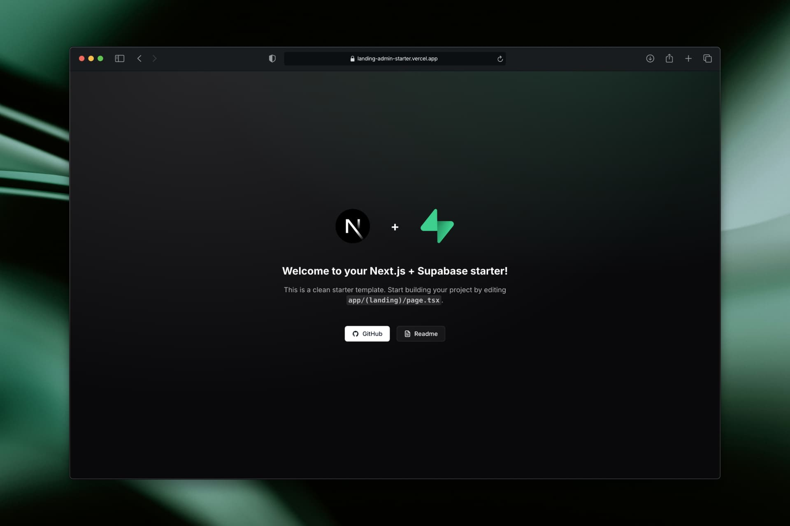

<div align="center">
  <a href="https://landing-admin-starter.vercel.app">
    
  </a>
  <p></p>
</div>

<div align="center">


</div>

Next.js 16 + Supabase + shadcn starter. Two halves: a **public landing** rendered with ISR and a **admin CMS** that edits it. Designed to be the base of any marketing/landing site that needs an in-app CMS, without re-architecting from scratch.

## What you get

- App Router (Next 16), Turbopack, React 19, TypeScript, Tailwind v4.
- Supabase auth (email/password) + `proxy.ts` protecting `/admin/*` (Next 16: no `middleware.ts`).
- Admin shell: collapsible sidebar, header with command menu, theme provider, React Query, sonner toasts.
- Reusable admin pieces: **DataTable** (TanStack), **resource form** (react-hook-form + Zod), **dialogs**, **drag-drop** reorder, **Cloudinary media picker**, **Tiptap rich-text editor**.
- Landing renders from Supabase via `unstable_cache` + tag invalidation; admin mutations trigger `revalidateLandingCache()`.
- Supabase CLI workflow: versioned migrations in `supabase/migrations/`, `pnpm db:push`, `pnpm db:types` for typed clients.
- Cloudinary API routes for signing/listing/deleting/renaming uploads.

## Supabase is optional

The app **boots and builds without a database**. `config.supabase.enabled` auto-derives from the two `NEXT_PUBLIC_SUPABASE_*` env vars: leave them blank to run the landing + admin shell with auth bypassed (great before you have a project), fill them in later to turn auth + DB on — no code changes. Committed `database.types.ts` baseline means types never break in the meantime. Details: [docs/10-supabase-optional.md](./docs/10-supabase-optional.md).

## Quickstart

```bash
pnpm install
cp .env.example .env.local      # Cloudinary now; Supabase optional (see above)

pnpm dev                        # runs without Supabase — admin auth bypassed
```

To enable Supabase, set the two `NEXT_PUBLIC_SUPABASE_*` vars, then:

```bash
# Local stack
pnpm db:start                   # docker-based local stack
pnpm db:reset                   # applies migrations + seed.sql

# Or link to a remote project
supabase link --project-ref <ref>
pnpm db:push
pnpm db:types

pnpm dev
```

Visit:
- `http://localhost:3000` — landing
- `http://localhost:3000/admin` — with Supabase on, redirects to `/admin/login` until you sign in (create an admin user in Supabase Studio → Authentication); with it off, the panel loads directly.

## Docs

Read in order:

1. [00 — Overview](./docs/00-overview.md)
2. [01 — Setup](./docs/01-setup.md)
3. [02 — Architecture](./docs/02-architecture.md)
4. [03 — Add a resource (CRUD walkthrough)](./docs/03-add-resource.md)
5. [04 — Admin components](./docs/04-admin-components.md)
6. [05 — Landing & ISR](./docs/05-landing-isr.md)
7. [06 — Auth & proxy.ts](./docs/06-auth-proxy.md)
8. [07 — Cloudinary](./docs/07-cloudinary.md)
9. [08 — i18n (optional)](./docs/08-i18n-optional.md)
10. [09 — Deploy](./docs/09-deploy.md)
11. [10 — Supabase (optional)](./docs/10-supabase-optional.md)
12. [AI prompts (copy-paste for Claude/Cursor)](./docs/ai-prompts.md)

Project-level conventions: [CLAUDE.md](./CLAUDE.md).
